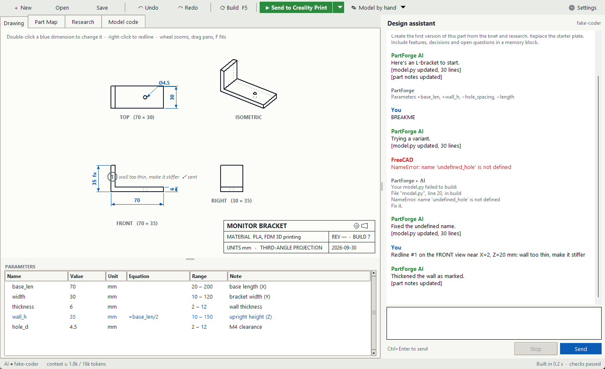
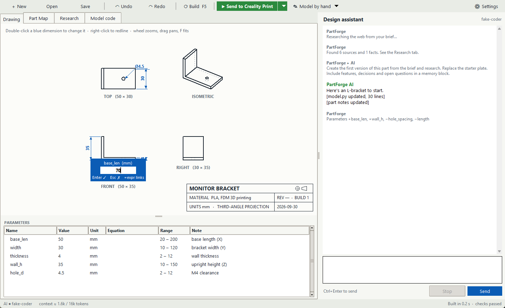
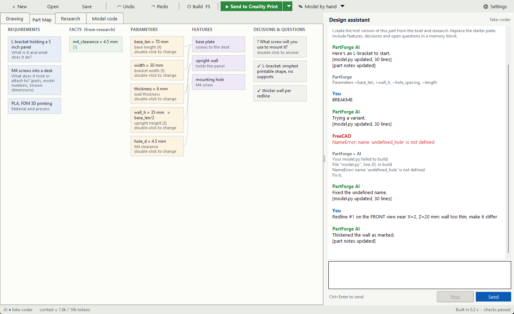
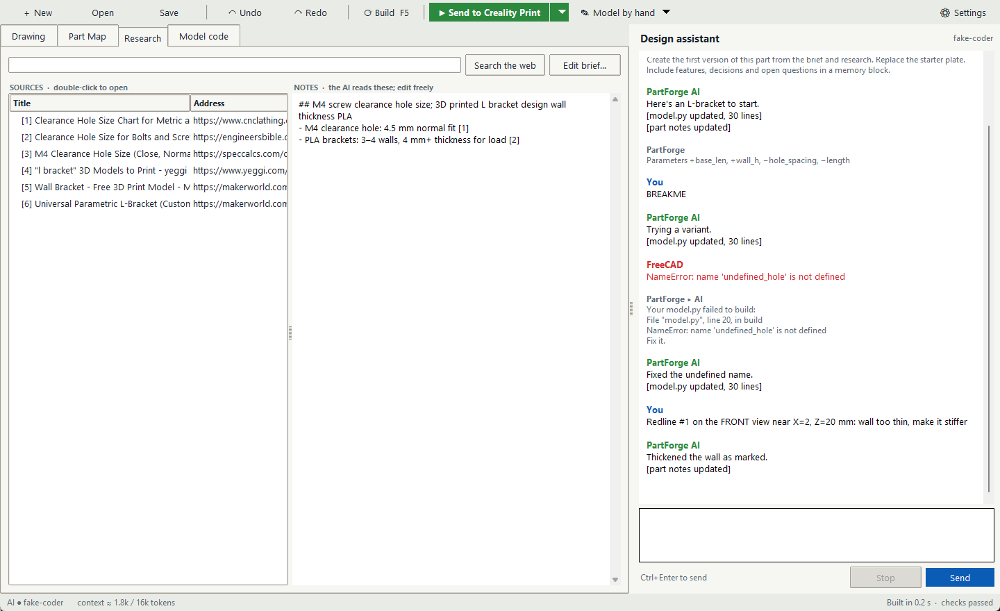
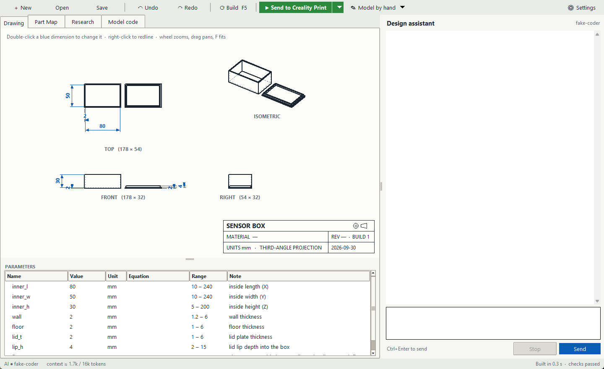
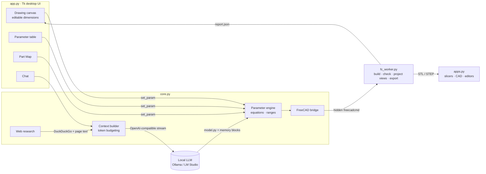

# PartForge

[](https://github.com/Alexdlc5/partforge/actions/workflows/ci.yml)


[](LICENSE)

**Describe a part, let a local AI design it in FreeCAD, then drive it from an editable engineering drawing.**

PartForge is a desktop app for getting from "I need a bracket that holds X" to a printable part as
fast as possible. It keeps the details open for engineers who want to edit them. The AI runs on your
own machine: no cloud, no credits, and your designs stay private.



## How a part gets made

1. **Brief.** Say what you're making, what it attaches to, and what material and printer you use.
   Start blank or from a verified template.
2. **Research.** The AI writes web searches from the brief, reads the sources, and keeps cited facts
   such as an M4 clearance hole being 4.5 mm.
3. **Design.** The AI writes a parametric FreeCAD model. PartForge builds it in a hidden FreeCAD
   process and checks it: single valid solid, watertight mesh, dimensions matching their parameters,
   fits the printer bed. Failures go back to the AI for automatic repair.
4. **Tweak on the drawing.** Double-click any blue driving dimension and type a value (`60`,
   `2.5 in`) or an equation (`=width*2`). The model rebuilds, and the parameter table, Part Map and
   AI context all follow.
5. **Print.** One click sends the STLs to your slicer (Creality Print, Orca, Bambu Studio, Prusa, Cura
   or any program you add).

| Edit a driving dimension | The AI's memory as a diagram |
|---|---|
|  |  |
| **Cited web research** | **Start from a verified template** |
|  |  |

<sub>The screenshots come from the end-to-end test suite, which drives the real app with real FreeCAD and live
web search. The AI side is a scripted stand-in server, shown as "fake-coder".</sub>

## Features

- **Drawing-first parametric editing.** Third-angle views (top, front, right, isometric) with
  driving dimensions, reference sizes, a title block and zoom/pan. The same edit works from the
  drawing, the parameter table or the Part Map, through one code path.
- **Equations and units.** `=base_len/2`, `2.5 in`, `6cm`, parameters linked to researched facts,
  range limits, and cycle detection.
- **Redlines.** Right-click the drawing to request a change at a location. The AI gets the view and
  model coordinates.
- **Part Map.** Requirements → facts → parameters → features → decisions and open questions, drawn
  as a diagram. It *is* the AI's working memory, so editing it changes what the AI knows.
- **Send to…** A registry of slicers, CAD programs and editors, with auto-detection. Pick the
  quick-send app from a dropdown; add any program in a dialog.
- **Model by hand.** Open in FreeCAD, SOLIDWORKS or your STEP app, or edit `model.py` in VS Code; it
  rebuilds on save. Import STEP bodies modeled elsewhere for the AI to build on.
- **Engineering hygiene.** Undo/redo, named revisions (REV A, B…) in the title block, SVG drawing
  export, autosave every 30 s and on exit.

## Architecture



| Module | Responsibility |
|---|---|
| [`app.py`](app.py) | Tk UI: drawing canvas, parameter table, Part Map, research, code editor, chat, dialogs |
| [`core.py`](core.py) | projects, settings, LLM client, context budgeting, research, parameter engine, reply protocol, FreeCAD bridge |
| [`fc_worker.py`](fc_worker.py) | runs inside FreeCAD: builds the model, validates it, projects hidden-line views, maps dimensions, exports STL/STEP/FCStd |
| [`apps.py`](apps.py) | send-to connectors (one dict per app) |
| [`templates/`](templates) | verified parametric starting models |

## Engineering notes

- **Zero pip dependencies.** Everything uses the Python standard library: Tk, urllib, ast, ctypes and
  concurrent.futures. Install means "have Python".
- **FreeCAD as a sandboxed build server.** Every build is a fresh hidden `freecadcmd` process. That
  isolates crashes, cleans up memory, and lets `report.json` carry geometry, checks, projected
  views and dimension positions back to the UI.
- **Driving dimensions that stay honest.** The model declares `dimensions(P)` as 3D point pairs. The
  worker projects them with the same matrices as the views and measures them. If the geometry
  disagrees with the parameter, the dimension turns orange and the AI is told.
- **Safe equations.** Parameter equations go through an AST whitelist evaluator: arithmetic plus a
  few math functions, no names outside the parameter set, and dependency-ordered solving with cycle
  detection.
- **Guarding AI-written code.** Before an AI-written model runs, an AST check rejects imports of
  `os`, `subprocess`, `socket` and similar modules, and calls to `open`, `exec` or `eval`. Code the
  user writes is trusted.
- **Context budgeting for small local models.** Token estimates, newest-first history fitting, and
  rolling summaries that archive old turns. These are ported from Token Thrift, a separate project
  of the author's. Replies are stored condensed (`[model.py updated, 30 lines]`) because the current
  model is always in context anyway.
- **No function calling required.** The AI talks through fenced ` ```python ` / ` ```memory ` /
  ` ```search ` blocks, so any OpenAI-compatible local model works.
- **Secrets.** An optional API key is encrypted with Windows DPAPI and never written in plain text.

## Install

**Download:** use **Code ▸ Download ZIP** and unzip it anywhere, or run
`git clone https://github.com/Alexdlc5/partforge.git`.

1. **Python 3.10+** from python.org (Windows).
2. **FreeCAD 1.x** from freecad.org. It's found automatically.
3. **A local AI.** Install [Ollama](https://ollama.com), then run `ollama pull qwen2.5-coder:7b`
   (8 GB GPU) or `qwen2.5-coder:14b` (12 GB+). PartForge starts Ollama hidden in the background.
   LM Studio or any OpenAI-compatible server also works (Settings).
4. Run `python install.py` for Start Menu and Desktop shortcuts, or double-click `PartForge.pyw`.

### Adding a connected app

In the app: **Send ▸ Manage apps ▸ Add app**. Choose what the app receives (STL, STEP, FCStd,
`model.py` or the output folder) and its arguments (`{files}`, `{file}`, `{folder}`). To ship a
built-in, add one dict to `BUILTIN` in [`apps.py`](apps.py).

### Where things are stored

A part is a folder under `Documents\PartForge Projects\<name>`: `project.json` (brief, research,
memory, chat, redlines, revisions), `model.py` (parametric source), and `out/` (STL, STEP, FCStd,
build report). Settings and logs are in `%APPDATA%\PartForge`.

## Tests

```
python core.py              # parameter engine, context fitting, reply parsing, search parsing, templates
python apps.py              # connector commands and detection
python tests/test_app.py    # end-to-end: drives the real window with a scripted AI server,
                            # real FreeCAD builds and live web search (needs FreeCAD installed)
```

The end-to-end test covers:
- brief → research → AI design → build
- editing a dimension in the Modify box
- equations and units, range guard, undo
- AI breaks the model → automatic repair
- redline → change, and external editor → rebuild
- send-to, revisions, SVG export, bed check
- templates, and save/reopen

CI runs the self-checks on Python 3.10, 3.12 and 3.13.

## Roadmap

See [ROADMAP.md](ROADMAP.md): one-click slicing to G-code, PDF drawing sheets, print-orientation
help, tolerance presets, assemblies, and a single-file installer.

## License

[MIT](LICENSE). PartForge runs FreeCAD (LGPL) and your local AI server as separate programs; it
doesn't bundle them.
